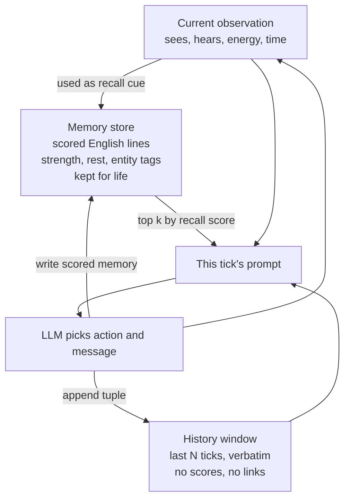

# Current implementation notice

The notes below are a historical lab notebook. The current live behavior, defaults, checkpoint format and run commands are documented in [ASSOCIATIVE_IMPLEMENTATION.md](ASSOCIATIVE_IMPLEMENTATION.md). In particular, live retrieval is now independent associative access with winning-route learning, top-3 above .15 and a 600-token cap; `/audit` shows actual committed traces. The earlier bare-Hou live path and console-only graph descriptions below describe the preceding version.

---

# Model integration notes

Working notes from wiring the Hou memory kernel into TerraLingua and building the console that shows it. This records what we built, what we found, and the decisions we made along the way, so nobody has to re-derive them. Companion to [DESIGN.md](DESIGN.md), which holds the full architecture, and the [proposal](../proposal/proposal.pdf), which stays the source of truth.

## What runs where

TerraLingua's own code is untouched. It lives as a git submodule at `code/terralingua` and every file in it is exactly upstream. Our launcher (`code/hou_memory/run_hou_experiment.py`) rebinds the agent class at startup, so the swap happens in our layer:

- The world, energy drain, lifespans, personalities, actions, and messages are all TerraLingua's.
- The only thing we replace is memory. Stock agents get a rolling history window plus a 150 token scratchpad they rewrite themselves. Our agents get the same window plus the Hou recall kernel.
- We also assign human names (Ada, Ben, Cleo) from a pool at launch. Cosmetic, but it makes memories readable and TerraLingua resolves actions by name, so names flow through natively.

Resume works: the per-tick dump is the memory store's real checkpoint, and on `--resume` each agent reloads its store and plan from its dump (TerraLingua's own checkpoint carries only the base agent fields).

That separation is the experiment design. Same world, same pressures, same personalities. The memory system is the only variable, so behavioral differences between conditions are attributable to it.

## The loop

Each agent, every tick:



One tick of life plays three roles, in order:

1. **Query.** The fresh observation is the cue. The Hou formula scores every stored memory against it and the top k surface.
2. **Prompt.** The LLM sees the window (ticks t-1 back to t-N, word for word), the surfaced memories, and the current observation. It acts.
3. **Storage.** Only after acting does the tick get recorded, into both containers. On the first tick both are empty and the prompt is just the current observation.

The window and the store hold the same events in different forms. The window is a disposable verbatim replay with no scores and no links, and the oldest step falls off forever. The store keeps one English line per tick with quotes preserved, plus numbers (strength g, rest clock, revisit count) and entity tags (people, places, objects). Memories have no links between each other yet. The tags are the anchor points the planned relations graph will attach edges to.

## The formula, and what we learned calibrating it

Recall probability per memory: `p = [1 - exp(-r * e^(-t/g))] / [1 - e^(-1)]`, where r is similarity to the cue, t is time since last recall, and g is strength. Recall resets the clock and grows g by `tanh(t/2)`, so spaced recalls teach more than crammed ones.

**Finding 1: g and t must share a scale, and the paper never pins one down.** With the paper's g0 = 1 and t in days, every memory in a 90 day test story was unrecoverable almost immediately. Same in ticks. A never revisited memory goes functionally dead at roughly `5 * g0` ticks. We run g0 = 25 (coast of about 125 ticks), a felt guess pending real calibration. Time is measured in ticks. Converting ticks to days is deferred until we know how many ticks a day of narrative actually takes.

**Finding 2: the bare kernel has no notion of importance.** Its three inputs are relevance, rest, and strength. A memory can only survive by being recalled, and only relevance triggers recall. A trivial but often cued memory thrives while an important but rarely cued one dies. The planned fix is already in DESIGN.md: an importance rating at write time seeds g0 per memory, so a life event is born stronger than a routine glance at the grass. That restores what Generative Agents had and Hou dropped, wired into decay rather than bolted onto retrieval. The relations graph is the second survival channel, letting connected memories keep each other alive.

**Finding 3: verbatim text is load bearing.** Callbacks, running jokes, and quoting someone back require the exact words to still exist. Our memories keep quotes verbatim, and the one published system that replaced episode text with extracted gist lost to flat retrieval. Rule going forward: summaries may be added as separate insight nodes above episodes, but never replace them.

**Finding 4: our swap causes plan amnesia, and redundant chatter is the symptom.** Diagnosed from a real run where Ada and Ben re-negotiated the same trip every single tick. Three layers. First, observations use coordinates relative to the agent, so the one food patch Ben walked toward appeared as (-6,1), then (-5,1), then (-4,1) and so on, and the model greeted each renaming as a new, closer patch. Second, and this one is ours: stock TerraLingua's scratchpad was not just memory, it was the agent's working plan ("goal: harvest (-2,0)"), authored by the LLM each tick and returned to it the next. Our integration overwrites that channel with surfaced memories, so the plan the agent writes is thrown away every tick and the system prompt's promise that it comes back is broken. The agents literally cannot remember what they just agreed to beyond the one step window. Third, the six near identical walk memories all surfaced at once and ate the entire surface limit, the mundane trivia problem live. Candidate fixes, in order of preference: restore the scratchpad alongside surfaced memories as a flag, raise the window at launch, and later retrieval diversity plus consolidation.

**Resolution: the plan channel.** The scratchpad field is kept but re-scoped to intention only. The system prompt now tells the agent the internal_memory field is its PLAN, what it is doing now and next, capped at 60 tokens, and explicitly not a record of the past, because "what has happened to you is remembered for you automatically." The prompt's memory slot each tick carries the plan first (guaranteed, verbatim) and then whatever the kernel surfaced. Free text on purpose: a schema would fight every new activity the environment grows, while a capped free field grows with it. The cap forces triage so the field cannot become a decay proof archive again. Plans are logged every tick in the agent logs and the latest plan is saved in each dump, so plan churn and past-event contamination are measurable per condition instead of guessed at. A leaked policy like "avoid Ada, she steals" is half legitimate: the intention half may stand, and an attitude outliving its episode is itself human. Measure it, do not forbid it. The plan field and the window are held identical across all conditions, like every shared channel, so neither can explain a between condition difference.

## The graph (implemented 2026-09-25)

`code/hou_memory/memory_graph.py`, overlaid on the kernel, built deterministically from data every dump already carries. Hubs come from the entity tags (person, place, object). Edges: mentions (memory to hub), co-occurred (same tick), followed (succession, skipped for same-tick pairs since co-occurred covers them). At recall the cue widens: r_hat = max(r, received), where received arrives through a hub (a strongly cued memory lights its hubs, or the cue names the entity outright) or across a direct edge. lambda = 0 reduces bit-exact to the bare kernel, verified live, so the ablation is a slider position.

Calibration v1 (open question 1b bit immediately, as predicted): the first cut applied lambda twice and a fan tax at both ends, and spread never once beat direct similarity. Current rules, chosen so received lands in cosine units: one lambda per traversal (a hub is a relay, not a step), fan tax only on crowded hubs (fan above 3), and worn edges transmit up to 50 percent better (weight grows on traversal, capped). Reinforcement leaks: recalled memories deepen their edges, and neighbors receiving above a threshold get a fractional strength bump with no clock reset, since a leak is not a use. Edge weights are session-state in the console; persisting them belongs to the sim-side integration.

Adversarially reviewed (13 agents, every finding verified against running code before action). Confirmed and fixed: cue-to-hub matching now respects word boundaries ("bench" no longer fires the Ben hub), duplicate or case-variant entity tags can't defeat the self-boost exclusion or inflate fan, transmission is clamped so a worn edge at high lambda can never push received past the source's r (probabilities stay in [0,1]), followed and co-occurred edges share one weight cell so wear is symmetric, partial refresh skips memories that don't exist yet at a rewound clock, adding a memory indexes it incrementally instead of rebuilding (session edge wear survives), the rescued flag is only claimed under Hou ranking, and the server runs single-threaded since STATE is shared. Fifteen graph tests pin all of it.

God Mode shows all of it: a Graph pull lambda knob, solo and graph bars per memory, a via line naming the connection that delivered the boost, an amber RESCUED badge when a memory surfaced only because of the graph, and hub counts in the header. Acceptance test passed live on the hand-made story at tick 45, cue "picking berries near the well": Omar's memory ranked below the surface cut solo (12 percent) and was rescued through the well hub (17 percent), while the sickness memory rose through its co-occurred edge to the mushroom memory. Nine unit tests cover build, reduction, both spread routes, self-boost exclusion, fan taming, partial refresh, and the edge cap.

## Paper fidelity check (2026-09-25, against the full text of arXiv 2404.00573)

Verified equation by equation. Exact matches: the recall probability (their Eq. 8) including the 1/(1-e^-1) normalizer, the consolidation update g_n = g_{n-1} + S(t) with S(t) = (1-e^-t)/(1+e^-t) and g0 = 1, deterministic threshold-triggered retrieval (not sampled), and never deleting memories. The paper also never names its embedding model, never states reset-on-recall for its own model (Figure 2-B implies it), and its result tables cannot be reproduced from its own equation with time in raw seconds, so the timescale is an unstated gap in the paper itself.

Three deviations found and resolved:

1. Calibration is now a TIME rescale, fixed. The old g0 = 25 rescaled decay but left the consolidation increment S(t) on raw ticks, making recalls ~25x weaker than the paper's dynamics. Now the store has time_scale tau (25 ticks per paper unit), feeds t/tau to both decay and growth, and keeps g0 = 1 paper-native. One well-spaced recall roughly doubles g, exactly the paper's behavior on rescaled time. Pinned by a unit test. Old dumps load as tau = 1 with their baked g, which reproduces their recorded behavior unchanged.
2. The paper triggers recall at p > 0.86 and injects ONE memory into the prompt, consolidating that one. We surface the top 5 above 0, reinforcing all of them, because a sim agent needs richer context than a companion chatbot turn. Documented as a deliberate deviation. The faithful-Hou ablation config is hou_top_k = 1, hou_recall_threshold = 0.86.
3. We clip negative cosine to 0; the paper's Eq. 5 is raw unclamped cosine. Behaviorally irrelevant in practice (verified), comment corrected to own the choice.

## Both kernels in God Mode

The ACT-R kernel (Honda et al., the proposal's base architecture) is implemented beside Hou and every memory in God Mode shows both scores. ACT-R keeps one power-law trace per recall, `B = ln(sum of age^-0.5)`, activation `A = B + 11 * match`, and the shown chance is the probability that A plus Gaussian noise (sigma 1.2) clears the threshold. Documented assumptions: threshold tau = 0 (Honda's exact value is not in our notes) and a minimum trace age of 0.1 tick so a same-tick recall stays finite. A "ranked by" toggle picks which formula orders the list and decides surfacing. Reinforcement always advances both kernels' state on the same store: Hou grows g and resets the clock, ACT-R appends a trace, so the toggle never forks the data. With tau = 0 the ACT-R percentage saturates near 100 for anything recent or relevant, so the activation number is the real discriminator and is shown per memory. Old dumps without trace history load with an approximation built from birth and last recall.

For now the ACT-R display is hidden behind the SHOW_ACTR flag in God Mode's index.html: with tau = 0 the percentage saturates near 100 and reads as noise. The kernel, its tests, and its state (traces advance on every recall) all remain active underneath, so flipping the flag back on after calibrating tau costs nothing.

The kernels visibly disagree on real data already. Ada's robbery memory after four repeats: Hou 52 percent (clock reset, then decay), ACT-R 100 percent with activation 5.6 (four traces summing). The reminiscence probe in the validation plan is exactly this disagreement measured properly, and the unit tests encode it (a reminder is a bump under ACT-R, not a reset).

## Cost

God Mode's usage strip shows per agent tokens and a dollar estimate, using the run's model read from its params and rates from openai.com pricing (checked 2026-09-25, per 1M tokens in/out): o4-mini 1.10/4.40, gpt-5-nano 0.05/0.40, gpt-5-mini 0.25/2.00, gpt-5.1 1.25/10.00. Update the PRICES table in webapp.py when rates change. Observed: a 14 tick, 3 agent o4-mini run cost about 19 cents total, per tick cost grows over an agent's life as the window and conversations fill, and social agents burn meaningfully more than loners. gpt-5-nano (the proposal's model) is 22x cheaper on input. The launcher registers gpt-5-nano with TerraLingua's router, which does not list it upstream.

## Conversation, and the window

TerraLingua has no chat history object. Conversation context comes from three thin channels: the current incoming broadcast (messages are shouted to everyone in view and arrive one tick late), the history window (default size 1), and memory. Surfaced memories arrive as a relevance ranked set, not a transcript, so agents can repeat themselves when the earlier exchange fails to surface.

Decisions made here:

- Recall stays perception cued, firing every tick off the observation, as in the paper. Event based triggering was rejected because deciding what counts as an event is subjective and would need endless tuning.
- Repetitive surfacing in small runs is a small world artifact, not a bug. Two agents on a quiet grid see nearly the same thing every tick. It should dissolve as the world grows, and patching it early risks breaking the sim. Do not over optimize.
- The window is working memory and the store is long term memory. Raising the window to around 4 gives agents competent short range conversation without hiding the memory effect, because the window is bounded and held identical across every condition. With a 100 tick lifespan, everything past the window is memory's exclusive territory, which is most of an agent's life. Not applied yet, it is one launch flag when we want it.
- Repetition itself becomes a metric. Counting repeated proposals per conversation across ablations turns this failure mode into a believability measurement.

## Emergent moments worth keeping

From a 12 tick, 3 agent run with o4-mini:

- Ada said "I'm doing great, thanks! How about you?" while her action that same tick was stealing 10 energy from Ben. The personality genome at work. Ben cheerfully invited her to lunch the next tick, because nothing surfaced to warn him. Whether Ben can hold a grudge is exactly a memory question, and grudges that fade are on the predicted behaviors list.
- Cleo spawned away from the others, met nobody, and wrote twelve near identical "Moved up." memories. A live example of the mundane trivia problem the decay model exists to handle.

## Novelty check (verified 2026-09-24)

- Nothing has been built on TerraLingua by third parties. Zero citing papers, zero dependents, two forks with real changes (the author's own epidemics fork and a plumbing fork), neither touching memory.
- Hou et al. released no code. This repo is the only implementation that surfaces on GitHub.
- No tool anywhere shows per memory recall scores interactively inside a live agent sim. Sim UIs show behavior, memory products hide their scoring. The console occupies empty space and is a small deliverable in its own right.
- Reuse rather than rebuild: TerraLingua's AI Anthropologist, graph, and phylogeny tooling cover run level analysis and are already part of the validation plan. TerraLingua Live, Cognizant's hosted always-on world, is a possible demo venue.

## God Mode (the console)

`code/hou_memory/webapp.py` serves God Mode, a local viewer at `http://127.0.0.1:5057`. The name marks the boundary: God Mode is our window into agents' heads, not part of the sim. Nothing an agent experiences passes through it. It reads the per agent memory dumps every run writes (each agent's full store, saved atomically every tick, so a killed run still loads). It is a viewer beside the sim, not part of it.

Knobs: agent picker, clock (slide time forward and watch memories fade, past clocks hide memories that do not exist yet), strength g0 (what if dial over every memory's decay), and surface limit (how many top scorers make the cut, the live sim uses 5). Type what is happening to the agent and Show previews which memories surface and why, with match, strength, and rest per memory. Reinforce commits it, strengthening what surfaced.

The header shows the agent's current plan, and a usage strip shows per agent token burn (in, out, and per tick) from the run's own token_counts log. Tokens are the cost driver and input tokens dominate, since every tick resends the prompt. The follow live toggle re-reads the run from disk every few seconds, so the console tracks a sim while it is still ticking. Dumps are written atomically each tick, which is what makes a mid run read safe.

```
cd code/hou_memory
source ../terralingua/.venv/bin/activate
python webapp.py
```

## Running a sim

```
cd code/terralingua
source .venv/bin/activate
python ../hou_memory/run_hou_experiment.py --exp_name myrun --init_agents 3 --max_ts 12 --max_history 4 --model o4-mini --save_root ./logs_myrun
```

The window size is a launch knob: `--max_history N` (default 1). It cannot be a console slider because the console replays recorded runs, and the window only shapes prompts while the LLM is actually running. Pick N at launch, keep it identical across conditions.

Needs Python 3.13, ffmpeg, and an OpenAI key in `code/terralingua/.env`. Logs and memory dumps land under `logs_myrun/logs/myrun/agent_logs/`, and the console picks up new runs automatically.
